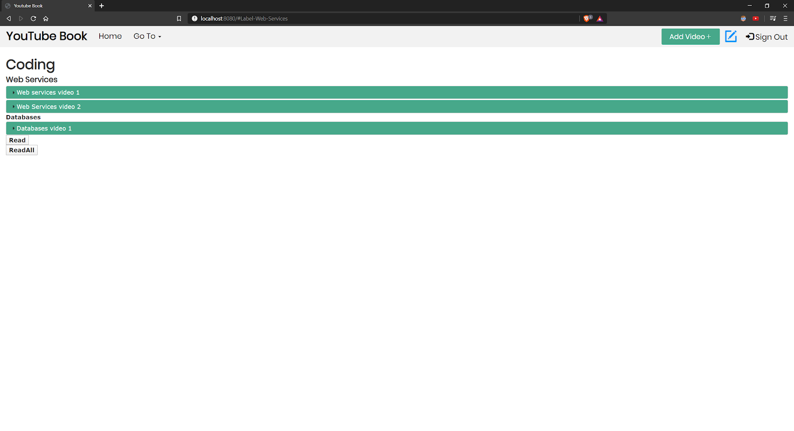
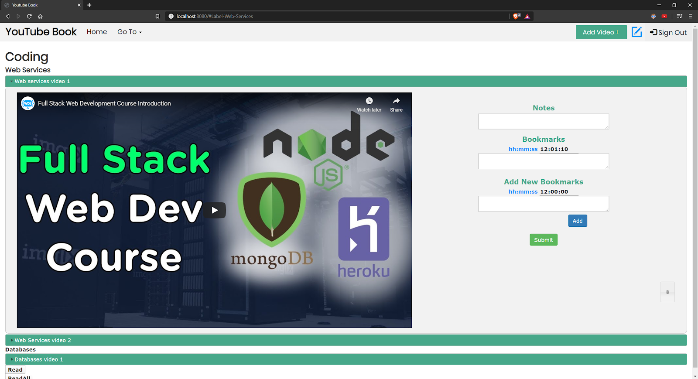

# Team Name: Kappa

## API Endpoints
Category, label, and video endpoint routes have the same parameters and return points, so we only show the examples for the video endpoints. We will focus on creating the video endpoints and will mock out hardcoded label and categories if there isn’t enough time.

**YouTube Book CRUD API**

Notes

* All endpoints are video CRUD operations. We will be hard coding Categories and labels. Originally we were planning on CRUD operations for category and label but decided to focus on video endpoints.

**Parameters**
* category : string
* label : string
* videoId : string
* All are required parameters if specified
* All responses are JSON

### Endpoints 
NOTE: Italicized words in routes are subject to change depending on video
1. POST Create video endpoint allows user to create a video on server
    * **/video/:username/create**
    * **Response:**
    * result : string (“created” or “Error”)
    * videoObj : object (json of the video object sent including (if applicable) category, label, title, videoURL, bookmarks, and notes)

2. POST Update video allows user to update their video book data
    * **/video/:username/update&videoId=*123***
    * Above route is a future plan for MongoDB implementation. Current route uses category and label from HTML: **/video/:username/update?category=*Coding*&label=*Web-Services***
    * **Response:**
    * result : string (“updated” or “Error”)
    * videoObj : object (json of the video object sent including (if applicable) category, label, bookmarks, and notes)

3. GET Read video endpoint allows user to read data from their video
    * **/video/:username/read?category=Coding&label=*Web-Services*&videoId=*123***
    * **Response:** 
    * result : string (“Read” or “Error”)
    *  Username : string (“eric” for now)
    *  Category : string (“someCategory” for now)
    *  Label : string (“someLabel” for now)
    *  Title : string (faker string for now)    
    *  Notes : string (faker string for now)
    *  Bookmarks: string (faker string for now)

4. GET ReadAll video endpoint allows user to pull down all the video objects from the user from each label e.g. Label 1 -[], Label 2 -[]
The data will be an array of arrays with the label’s video objects
    * **/video/:username/readAll**
    * **Response:**
    * result : string (“Read all videos” or “Error”)
    * Username : string (“eric” for now)
    * videoData: [][] - array of arrays, where each array is the list of video objects under the label

5. GET Delete video endpoint allows user to delete the video specified
    * **/video/:username/delete?category=*Coding*&label=*Web-Services*&videoId=*123***
    * **Response:**
    * result : string (“Deleted” or “Error”)
    * videoObj : object (json of the video object sent including (if applicable) URL, title, videoOrder, bookmarks, and notes)

## Client Interface Descriptions
* Upon first visiting the site, users are greeted with this login screen. They must log in to access their personal Youtube Book.

* Once logged in, the user will be greeted with something like this. This lists a user’s videos. There are three for this mock user, all in the “Coding” category. Two have the “Web Services” label, and one has the “Databases” label. Pressing “read” will run our “read” function on mock data, and “readAll” will run our “readAll” function skeleton that will be implemented to read all videos on the page and return their data. These are temporary buttons just to show the functions work. In our future implementation, these buttons will “read” and “readAll” will only be used for first displaying all the videos a user has created when first logging in. There will be no front end interaction for these.

* Clicking one of the green bars below will expand the video, and show all data the user has input for that video. Here, the user has one bookmark at timestamp 1:10, with no notes or bookmark notes. Pressing the “Submit” button is for updating the current video (after you input some new notes and/or bookmarks in the text areas), and is where our “update” function is called. The trashcan icon at the bottom right of the video panel runs our “delete” function, and in future implementations will delete the video from the page entirely.

* Selecting “add video” (top right of above screenshot) will bring up a modal like the one below, where you can input a YouTube URL and add some details in about the video you’re adding to your YouTube Book. Pressing “submit” will run our “update” function on that video.

* Finally, selecting “Go To” brings up a list of categories and labels that you can quickly click to jump to. The pencil icon next to “Add Video+” in the top right is for editing the ordering of videos, and will bring up a modal shown in the center of the screen below. But, functionality for this is not implemented yet. “Sign Out” will currently redirect you to the login screen.

**Heroku URL: https://cryptic-basin-95763.herokuapp.com/**

## Breakdown of Work
Eric
* Finished setting up YouTube bookmarks and players
* Created routing for video create and the dialog popup creating it.

John
* Implemented delete video
    a. UI
    b. Client and server code
* Reformatted main video UI & add video modal

Trent
* Implemented read and update (client and server)
* Implemented readAll skeleton (client and server)
* Various routing fixes
* Implemented feedback on HTML page for data updates
* Milestone2.md: Screenshots and client interactions with our interface, co-edited endpoint data, coverted to markdown format from Google doc
